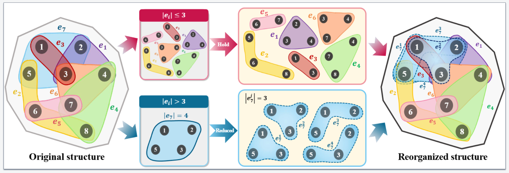

# Unveiling the Role of Higher-Order Interactions via Stepwise Reduction
[](https://doi.org/10.48550/arXiv.2411.05685)


Source code for paper: [Unveiling the Role of Higher-Order Interactions via Stepwise Reduction](https://doi.org/10.48550/arXiv.2411.05685)



Overview of n-reduced graph: the n-reduced graph is an approximated representation of the original hypergraph
that consists of hyperedges of orders no greater than n, with the goal of minimizing information loss,
which is particularly suitable for evaluating the role of hyperedges with orders larger than a threshold.

## Dependencies
Compatible with Python 3.x.

## Citation
If you use this project in your research, please cite:

```bibtex
@article{bian2024beyond,
  title = {Unveiling the Role of Higher-Order Interactions via Stepwise Reduction},
  author = {Bian, Junhao and Zhou, Tao and Bi, Yilin},
  journal = {arXiv preprint arXiv:2411.05685},
  year = {2024}
}

